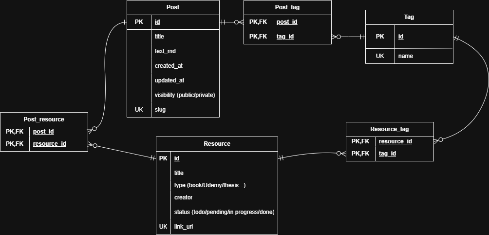

# DB設計
## エンティティ抽出
- 記事：自分が書く記事
  - タグ
- 本（情報源）
  - タグ

## ER図

**【考慮点】**
- `Post`テーブル
  - `text_md`は、いずれ単語等でブログ内検索を書けることができるようにするため、ファイルパスでなく、生のmdで実装。
  - 代理キー`id`に関して、`slug`又は、`title_eng`+`created_at`の複合主キーも候補としては上がるが、投稿後のタイトル変更等を考え、`id`で運用する。
- `Tag`テーブルの共有
  - 「タグ」を「ブログ記事」と「参照文献」で共有している点については、個人のブログの為、タグ数はそこまで増えないこと、そして、分離した際に少々設計が複雑になる為、一旦共有する形とする。(フィルタリングは`Post_tag`と`Resourse_tag`テーブルにするか否かで実装できる。)
- `Post_resource`テーブル
  - 当初この関連エンティティ無しの予定だったが、ブログで「今月読んだ本3選」みたいなブログ書きたいときのため。
- `Post_tag`テーブル
  - `post_id`と`tag_id`の複合主キーで実装している。RDBMSでは、左のカラムから順番に評価される。`WHERE tag_id=5`等の`tag_id`を起点とした検索はインデックスが効かない。⇒`tag_id`には**ビットマップインデックス**を採用する。
    - ビットマップインデックスの欠点である「更新時のロック範囲」や「多カーディナリ」はあまり大きな欠点とならない。個人ブログであるため、高頻度の更新は無いし、カテゴリもそんなに作成しないと考えられる。
