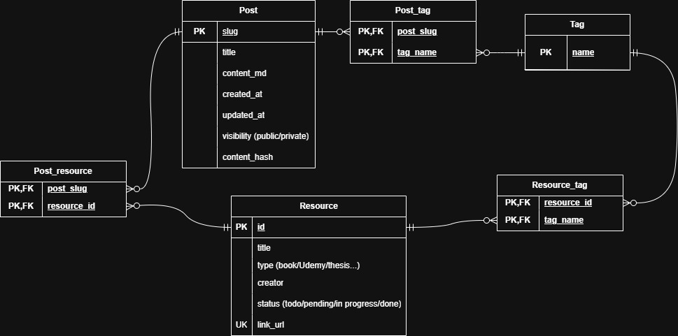

# DB設計
## エンティティ抽出（制約）
- 記事：自分が書く記事
  - `slug`：主キー。
  - `title`：NOT NULL
  - `content_md`：生のマークダウン
  - `created_at`：記事作成日,NOT NULL
  - `updated_at`：記事更新日（更新があった日で随時更新）,NOT NULL
  - `visibility`：**public** / **private**。NOT NULL, デフォルトはNOT NULL
  - `content_hash`：NOT NULL
- 情報源（Resource）
  - `id`：主キー
  - `title`：NOT NULL
  - `type`：NOT NULL(book/Udemy/thesis/pdf等)
  - `creator`：NOT NULL
  - `status`：DB側では文字列で管理し、アプリケーションコード側で定数管理。
  - `link_url`：情報源のリンク、UNIEQUE
- タグ
  - `name`：主キー

## ER図

**【考慮点】**
- `Post`テーブル
  - `slug`を主キーにした理由は、今後Github上で記事を管理しようと考えており、投稿済みか否かをGithub上のmdのメタデータに含むことで、管理しやすくなるからである。
  - `text_md`は、いずれ単語等でブログ内検索を書けることができるようにするため、ファイルパスでなく、生のmdで実装。
  - `content_hash`について、記事内容を全件検索はパフォーマンス的にダサいので、このハッシュ値で管理する。
- `Tag`テーブルの共有
  - 「タグ」を「ブログ記事」と「参照文献」で共有している点については、個人のブログの為、タグ数はそこまで増えないこと、そして、分離した際に少々設計が複雑になる為、一旦共有する形とする。(フィルタリングは`Post_tag`と`Resourse_tag`テーブルにするか否かで実装できる。)
- `Post_resource`テーブル
  - 当初この関連エンティティ無しの予定だったが、ブログで「今月読んだ本3選」みたいなブログ書きたいときのため。
- `Post_tag`テーブル
  - `post_id`と`tag_id`の複合主キーで実装している。RDBMSでは、左のカラムから順番に評価される。`WHERE tag_id=5`等の`tag_id`を起点とした検索はインデックスが効かない。⇒`tag_id`には**ビットマップインデックス**を採用する。
    - ビットマップインデックスの欠点である「更新時のロック範囲」や「多カーディナリ」はあまり大きな欠点とならない。個人ブログであるため、高頻度の更新は無いし、カテゴリもそんなに作成しないと考えられる。

## 採用するDBMS
- **Cloudflare D1(SQLite) **
  - 無料
  - サーバーレスアーキテクチャ使ってみたかった
  - デプロイはCloudflarePagesで行うため相性良さそう
