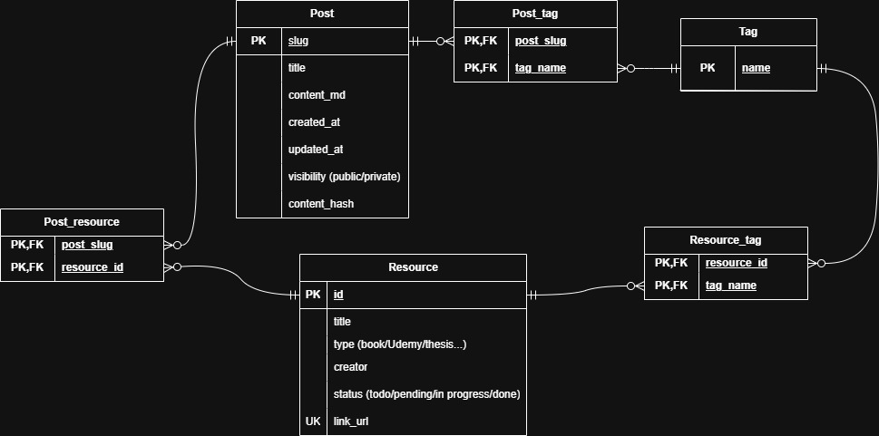

今回『[達人に学ぶDB設計指南書 初級者で終わりたくないあなたへ](https://amzn.asia/d/034JISO9)』を読んだので、そのアウトプットとしてまとめる。読もうか悩んでいる人や気になっている人にぜひ読んで頂けたらと思う。実際にこの本で学んだことを基にDB設計もしてみたので、この本を読んだらどの程度できるようになるかを想像していただけたらと思います。

本記事は以下のような構成となっています。
1. 筆者のスペック
2. 身に付いたスキル
3. 個人的に刺さった学び
4. やらかし防止：学んだアンチパターン
5. 実践：当ブログを想定したDB設計をやってみた
6. まとめ

## 1. 筆者のスペック
- 地方国公立大学情報学部CS専攻
- 基本的なCS知識は知っている（応用情報技術者合格程度）
- SQLという言語やDBという存在を認識している程度

## 2. 身に付いたスキル
- **論理設計**（正規化,ER図）⇒ **物理設計**（インデックス、ハードウェアのサイジング、RAID、ファイルの物理配置）⇒ **運用**（バックアップ/リカバリ、クラスタリング）の流れで設計・根拠の説明ができるようになる
- **各設計におけるトレードオフの考え方**を説明できるようになる
  - 整合性（正規化）とパフォーマンスのトレードオフ
  - 各インデックスの向き・不向き

## 3. 個人的に刺さった学び
### データを中心に設計する事の重要性（DOA原則）
- データ⇒プロセスの順に考える。現実世界のデータの意味を中心に考えるべきという原則
- プロセス（業務の内容）は変わるが、データはめったに変わらない。不変なものを中心に設計することで、変更に強いシステムが出来上がる。
- DOA原則に従うと正規化はすればするほど良い。（正規化＝データの整合性を高める操作のため。） 🤔正規化って影響範囲を最小限に留める作業とも言えるのでは…
### 論理設計における理想と物理層の現実の対立
- データの整合性を高めるために正規化をすればするほど、パフォーマンスが下がること（エンティティの分離が進み、SQLの`JOIN`句が増え、結合によってパフォーマンスが落ちる。）
- よく第三正規化まででいいと言われるのは、ソフトウェアで問題となる更新異常を全て回避できるのとパフォーマンスとのバランスが取れた正規形であるため。

## 4. やらかし防止：学んだアンチパターン
- [ ] **非スカラ値が無いか（第1正規形未満）** 👈カラム設計はなるべく分解不可能な値まで分割すべき（例：`氏名`⇒`姓` `名`, `e-mail`⇒`ローカル部` `ドメイン部`
- [ ] **キー列が固定長文字列になっているか** 👈キーは不変性を持ち、同じ属性のキーは同じ型になるべき
- [ ] **安易に代理キーを使用していないか** 👈代理キーは業務目線では本質的な無意味なキーであるから。
- [ ] **行持ちテーブルが無いか** 👈無意味なNULLが生まれる可能性がある。列持ちテーブルにしよう。

## 5. 実践：当ブログを想定したDB設計をやってみた
第2章流れに沿って、論理設計⇒物理設計⇒運用の順で設計した。
### ① エンティティの抽出（論理設計）
- **記事**：自分が書く記事
- **情報源**：ブログを書く時の参考資料
- **タグ**：記事や情報源に付与するタグ

### ② ER図の作成（論理設計）

- 多対多の関係になったテーブルの関連実体の作成
- 列持ちテーブルの作成
- 更新時のパフォーマンスを考慮した記事内容の変更検知用のハッシュ値の追加

**【細かい考慮点】**
- `Post`テーブルの`slug`を主キー
  - `title`を主キーにしてしまうと、「今年のまとめ」みたいな記事をかけなくなってしまうから、タイトルの重複を許すために。
- `Post`テーブルの`text_md`はあえてファイルパスでなく、**生のマークダウン**
  - ファイルパスで実装した方がデータサイズは抑えられるが、ファイルパス管理にするとDBとファイルの同期ズレや単語等でブログ内検索機能の追加など、運用の単純化と今後の拡張性を考慮。
- `Post`テーブルの`content_hash`
  - 更新時の変更検知に関して、記事内容を全件検索はパフォーマンス的に良くないので、このハッシュ値で管理。
- `Resource`テーブルの`id`の代理キー
  - 様々な媒体に対応する為。（当初書籍のISBN等で対応しようとしていたが、情報源が書籍のみとは限らない為却下）
- `Tag`テーブルの共有
  - 「タグ」を「ブログ記事」と「参照文献」で共有している点については、個人のブログの為、タグ数はそこまで増えないこと、そして、分離した際に少々設計が複雑になる為、共有する形とする。
- `Post_resource`テーブル
  - 「今月読んだ本3選」みたいなタイトルで記事を書くかもしれないので複数参考文献を追加できるように。

### ③ 物理設計（インデックス）
- `Post_tag`テーブルの`tag_id`にビットマップインデックスを採用
  - このテーブルは`post_id`と`tag_id`の複合主キーで構成されている。RDBMSでは、左のカラムから順番に評価される。その為、`WHERE tag_id=5`等の`tag_id`を起点とした検索はインデックスが効かないため。
  - また、ビットマップインデックスの欠点である「更新時のロック範囲」や「多カーディナリ」はあまり大きな欠点とならない。個人ブログであるため、高頻度の更新は無いし、カテゴリもそんなに作成しないと考えられる。
### ④ 運用（冗長化、リカバリ）
- Githubを使った冗長化（RAID1的な発想）
  - 現段階でタグや情報源単体の追加は実装しておらず、ブログに関して、ローカルからGithubリモートリポジトリにPush⇒Github ActionsでDBに反映というロジックで実装している。その為、DBが障害に合ってもGithubリモートリポジトリ又はローカルのブログデータを再度読み取れば復旧できる算段がある。

## 6. まとめ
　この本では、DB設計の方法論だけではなく、DOA原則を基にした"思想"と共に書かれており、DB設計がなぜ重要かを理解しながら、方法論まで学べた。

変更が容易という特徴を持つソフトウェアにとって、不変なデータを中心に置くDOA原則は非常に相性が良いものであると思った。変更が容易であるからこそ、その基盤は固く不変なもの（データ）でなくてはいけない。すごく勉強になった。

最近はコーディングはAIで全て行えるというのをX等で目にするが、もしAIがコーディングを担うようになったとして、更にこのDBの設計が重要になってくるだろう。

本書の中でこんな言葉が出てきた。

*戦略の失敗を戦術で取り返す事はできない*

システムの品質を決めるのは設計である。プログラミングは設計を翻訳する作業である。どれだけ凄腕のエンジニアでも煩雑な設計の上でエレガントなプログラムを書く事はできないという事だ。

いくらAIであったとしても、適当に構築されたDBのうえでは、良いコードを書く事はできないだろう。

AIが最大限価値を発揮できる環境を作り出す事がソフトウェアエンジニアの仕事になっていくのだろうか。Anthropic CEOによると「6～12か月以内でAIがソフトウェアエンジニアの業務をほとんどこなせるようになる」と発言している。正直、1年後2年後を考えると不安にはなる。しかし、考えても仕方ないというのが実際のところだ。今できることを最大限やる。それだけだと思う。

全力で今を楽しもう！やるしかないね～

是非『達人に学ぶDB設計指南書』読んでみてください！
最後まで読んで頂きありがとうございました！
